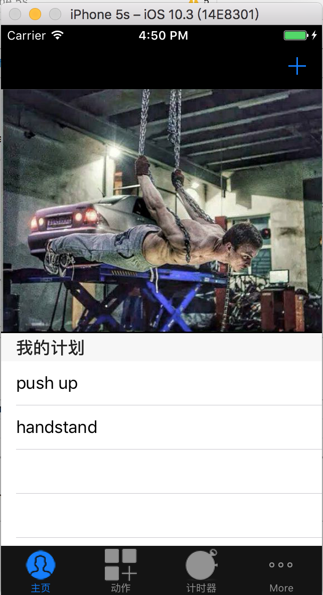
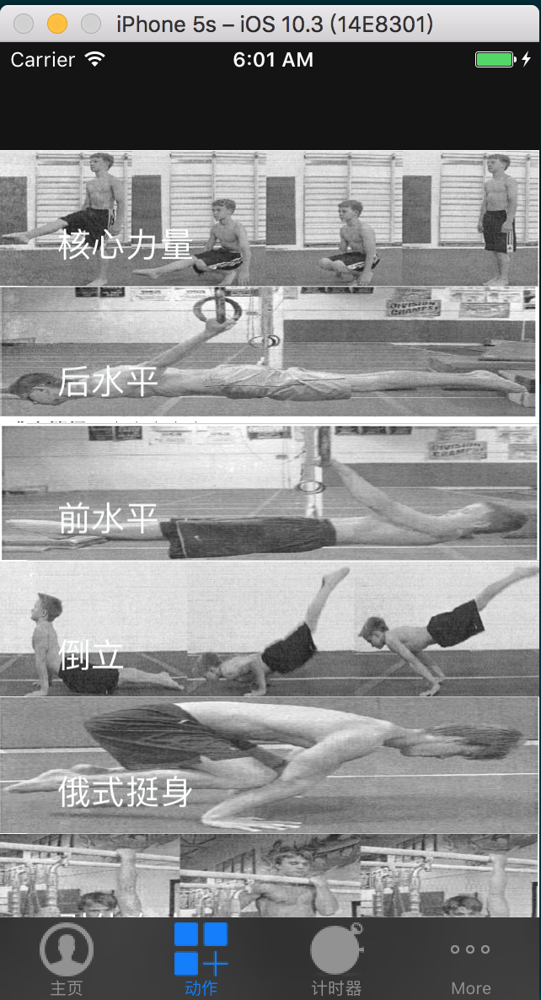
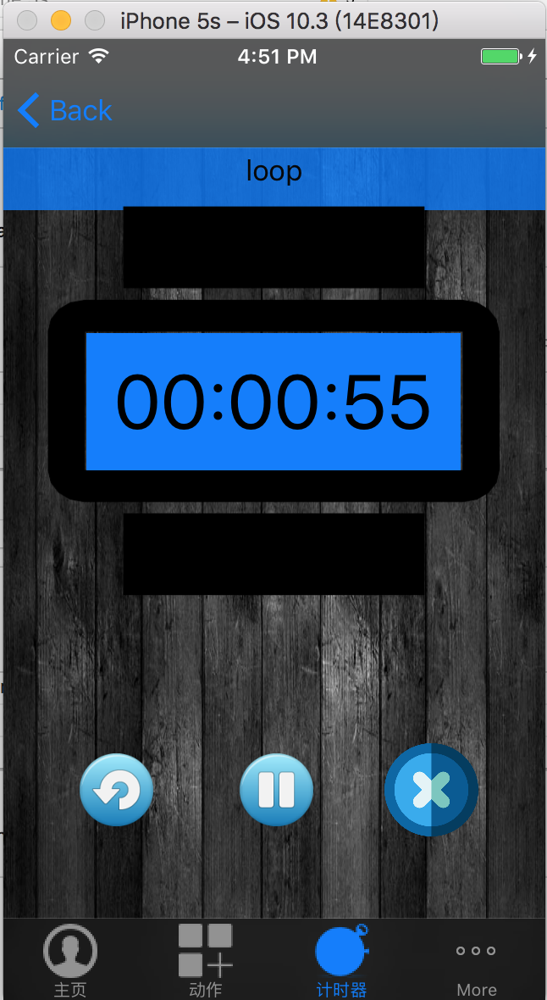
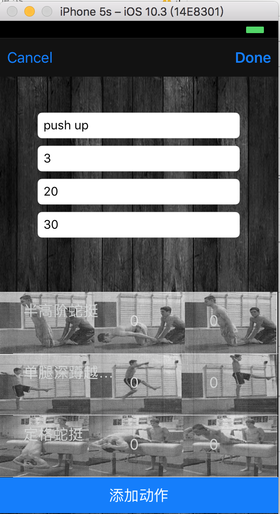
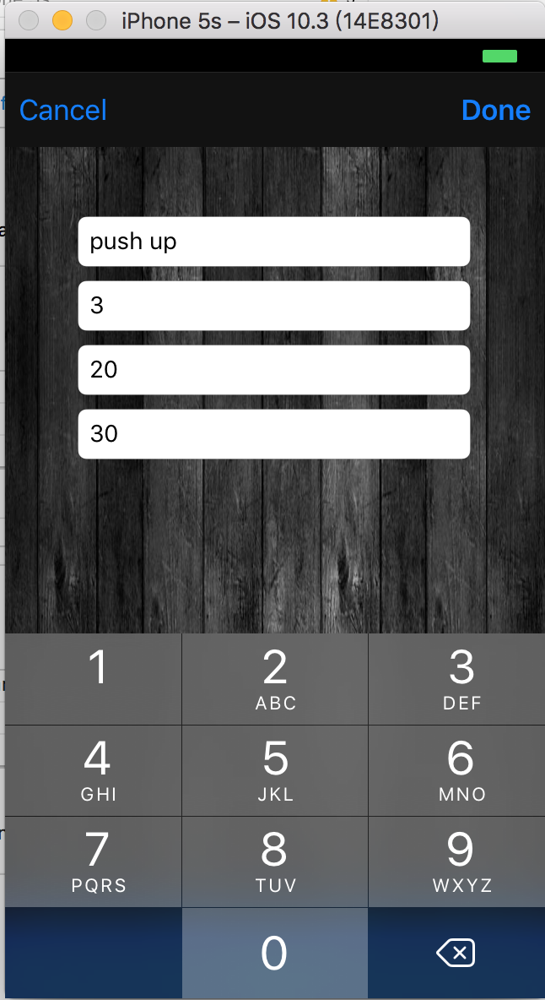

# 极限健身app
## 序言-开发app的初衷
### 1.少年你为何而战
曾经因为作息和饮食的不规律，导致身体严重肥胖（163cm-75kg），看着镜子的自己，大肚子双下巴，回想从高中到大学喜欢篮球喜欢跑步的我，那个能快速变向突破上篮的快小子，不禁唏嘘，觉得自己在成为一个胖次的路上越走越远(┬＿┬)↘。
那并不是我想要的，也不是真正的我，从那一刻起，我决定认真地减肥。由于不懂健身知识，那就摸着石头过河，从网上找健身资料，训练教程，定制健身计划，每天坚持7-10公里跑步，做俯卧撑，瑜伽，举铁。记得那时每天都会有不同部位的酸痛，今天手臂累了明天练腰，腰累了那就练脚，有时候全身都酸，那就咬咬牙坚持。同时严格控制自己的饮食，有时候一天两顿，早上只吃一碗麦片+沙拉，晚上不吃饭。
经过3个月的坚持，我成功从75kg减到59kg，目标也算是达到。可是经过几个月的思考，我觉得自己的训练方式有很大的问题。我只是鲁莽地为了瘦而瘦，并没有真正地训练强大的身体。这时一部电影深深地鼓励和我，《激战》，我觉得这才是一个男人该有的样子，我决定拼一把，报名散打班，于是就开始了每天被各种脚踢拳打的旅程，每天睡觉被疼痛惊醒，累成狗的样子，有时候觉得身体某个部位已经不是自己的。6个月后我成功从59kg增肌到67kg。身体大了一圈。再也不是那个虚胖次了。
### 2.然而这就是终点了吗？
偶然的一次机会，我从网上看到一个视频，一个16岁少年的健身历程。对同样经历的我深深地产生了共鸣。
那一刻，仿佛打开了一个崭新世界的大门，我发现找到了自己想要的健身方法，一种自由，freestyle，真正热爱的东西。barbrother，street workout。于是我决定再次上路，目标街头健身！我在路上重新出发！
<iframe height=498 width=510 src='http://player.youku.com/embed/XMjUwODEwNjA0MA==' frameborder=0 'allowfullscreen'></iframe>
### 3 一切源自热爱
从网上自学找教程，从零开始的过程，我意识到，多少人因为自己知识的缺乏找不到适合的自身健身方法，错误的健身方法带来了不必要的损伤，多少人因为不能有效地组织和评估自己的训练情况而，望着无止尽的，止步不前的进度，放弃了健身。我觉得很可惜，同时也知道了循序渐进计划的重要性，谁都不能一口吃成一个胖子（除了我（○｀ 3′○））于是我想到开发一款手机app，根据一本叫做《体操健身指南》的书籍，同时根据自己crossfit的训练经验，，将tabata训练方法增加到其中。于是这个健身app就这么开始了。
## app功能介绍
用户根据每个动作的训练目的，定制循序渐进的动作难度计划，比如今天练上半身，则可以新建一个针对上半身的训练计划。然后再新建一个下半身的训练计划。每个训练动作都要从简单到困难的选择，可以设置训练次数，训练时间，用户可以从最简单开始慢慢到最困难。同时app还有定时器自主添加定制的功能。
下面是软件的基本界面：

## 后话
软件的功能并不完善，后面将加入优酷视频板块，还有用户评估板块，同时支持微信微博三方认证。
如果你有什么酷的创意和一件，可以共同交流，感谢健身路上的伙伴们，共勉。

## 联系
mail：captain2conner@163.com
